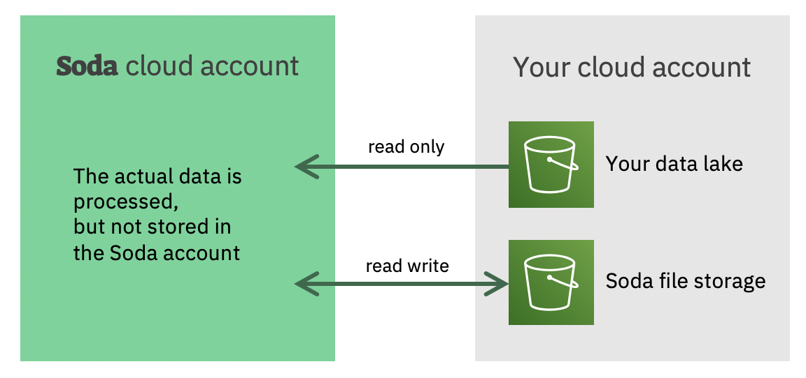

# Soda's architectural principles

### No data leaves your cloud account

The whole architecture of Soda is built
around the notion that no data can leave your account.
We realize this by deploying our software in a cloud 
account under your control and close to the data.

### We deliver Software as a Service (SaaS)

Even when we deploy the software in your cloud account, we 
operate, maintain and the software as a service.  This frees 
your operations team from the burden of learning the 
technical details.  Afterall, we know best how to operate 
our own software.

### Typical setup

In a typical setup, the Soda software components are 
deployed in a new account under the control of the client.
The data is typically located in a separate account which 
has more stringent control.

Whenever Soda stores data like failed rows or sample 
data, it does so in a configurable storage location.  This
is typically next or close to the actual data. 

While this is a typical setup, the Soda setup can be 
tailored to meet your specific needs.
