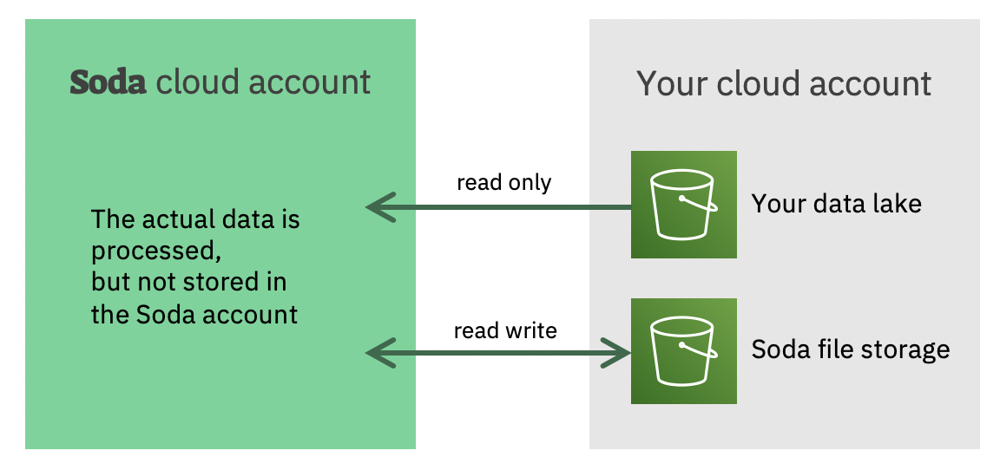

# Soda's architectural principles

### No data leaves your cloud account

The whole architecture of Soda is built
around the notion that no data can leave your account.
We realize this by deploying our software in a cloud 
account under your control and close to the data.

### We deliver Software as a Service (SaaS)

Even when we deploy the software in your cloud account, we 
operate, maintain and the software as a service.  This frees 
your operations team from the burden of learning the 
technical details.  Afterall, we know best how to operate 
our own software.

### Typical setup

In a typical setup, the Soda software components are 
deployed in a new account under the control of the client.
The data is typically located in a separate account which 
has more stringent control.

Whenever Soda stores data like failed rows or sample 
data, it does so in a configurable storage location.  This
is typically next or close to the actual data. 

While this is a typical setup, the Soda setup can be 
tailored to meet your specific needs.

# Soda components

### Soda user interface

The Soda user interface is a web application that allows any user 
with access to get login and access Soda without installing any 
new software. 

### Soda application

The Soda application is the server of the Soda user interface as 
well as the Soda web API.

The Soda application is an executable Java jar file that only 
requires a Java runtime. Open JDK 8+ is required and Open JDK 11+ 
is recommended. 

The Soda application connects to the Soda database for the majority 
of the user interactions.  It also can launch Spark jobs and 
access the Soda file storage.

The Soda application is stateless.  Which implies that multiple 
Soda application instances can be deployed behind a load 
balancer.

### Soda Database

The Soda database contains the following metadata about the data
in the data lake:

* Users
* Permissions
* Connections
  * Storage location details
  * Access credentials
* Metrics
  * Metadata about the data like the type, distributions, etc  
* Tests
  * Expectations about the data
* Scheduling
  * When should each test be executed to monitor the data
* Test results
* Alerts
  * Failed test results

### Soda Spark Cluster 

TODO explain what the Spark cluster does

### Soda file storage

TODO explain what the Soda file storage contains

#### Soda test suggester

TODO 

##### Soda Application Logs

TODO What do the logs contain, where are they sent. They do not contain the actual data.

# Soda on AWS

Installation is done with Terraform script.

# Soda on Azure

Coming soon.  [Contact us](mailto:info@sodadata.io?subject=About+Soda+on+Azure) for latest update.

# Soda on GCP

Coming soon.  [Contact us](mailto:info@sodadata.io?subject=About+Soda+on+GCP) for latest update.
