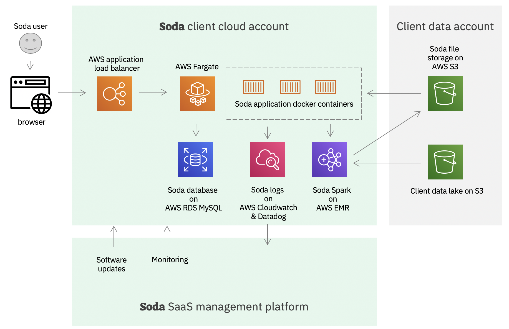

# Soda on AWS

### The Soda client account

The Soda client account is under control of the client.  It's typically a 
new, separate AWS account that is created to deploy the Soda software.

We install the full Soda software stack with a Terraform script.

### The Client data account

Typically the client data account is more locked down.  

### The Soda SaaS management account

The Soda SaaS management account is a single account under the control of Soda.
From here we manage all the Soda deployments like monitoring and pushing updates.
